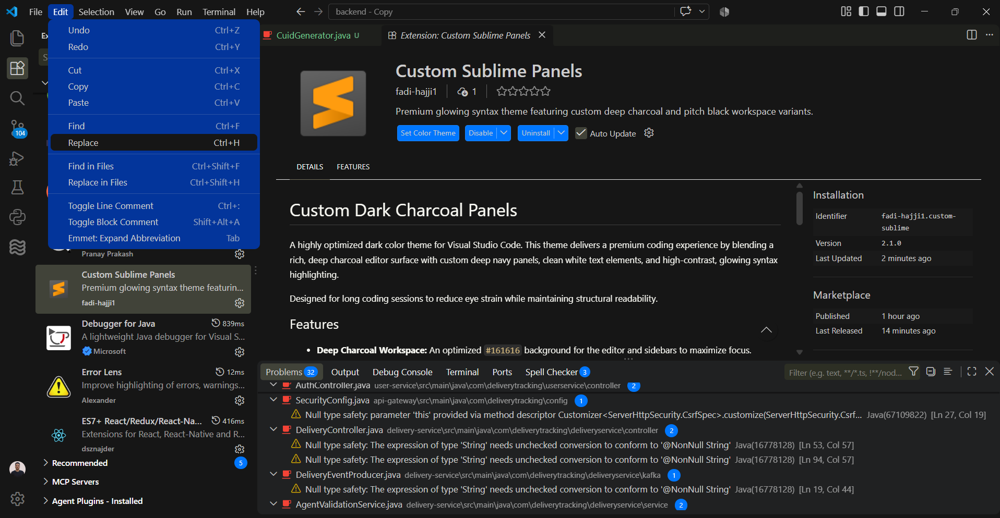
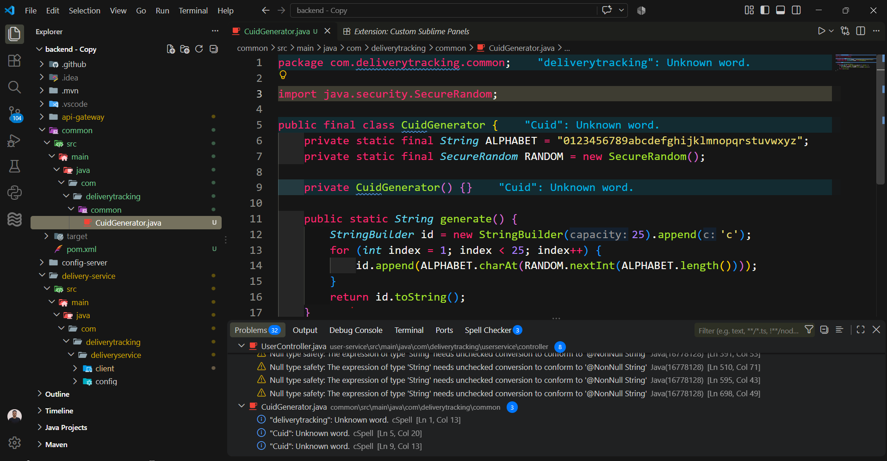

# Custom Dark Charcoal Panels

A highly optimized dark color theme for Visual Studio Code. This theme delivers a premium coding experience by blending a rich, deep charcoal editor surface with custom deep navy panels, clean white text elements, and high-contrast, glowing syntax highlighting.

Designed for long coding sessions to reduce eye strain while maintaining structural readability.

## Features

- **Deep Charcoal Workspace:** An optimized `#161616` background for the editor and sidebars to maximize focus.
- **Neon UI Accents:** Vivid blue activity bars, badges, and active tab highlights (`#03129b` and `#0077ff`) to make navigation effortless.
- **Vibrant Syntax Color Scheme:** High-contrast text colorization across JavaScript, Python, C#, C++, and HTML/CSS.
- **Clean Readability:** Carefully calculated foreground balances to ensure your code stands out clearly without being overly blinding.

## Screenshots

### DropDown menu View


### Panels View


## Installation

1. Open **Visual Studio Code**.
2. Go to the Extensions view (`Ctrl+Shift+X` or `Cmd+Shift+X`).
3. Search for **Custom Sublime Monokai Panels** (or your custom display name).
4. Click **Install**.
5. Press `Ctrl+K` then `Ctrl+T` (or `Cmd+K` then `Cmd+T` on Mac) and select **Custom Sublime Monokai** from the menu.

## Recommended Settings

For the absolute best visual experience, add the following snippet to your user `settings.json` file to enable smooth font rendering and clean indent guides:

```json
{
  "editor.renderWhitespace": "selection",
  "editor.guides.indentation": true,
  "editor.guides.activeIndentation": true
}
```

## new vscode border remover
```json
{
 
		"surface.border": "#00000000",
    "modernPanel.border": "#00000000",
		"sash.hoverBorder": "#00000000",

}
```

## Development

Install the VS Code Extension Manager CLI once:

```sh
npm install -g @vscode/vsce
```

Package or update the extension as a `.vsix` file:

```sh
vsce package
```

To test locally before publishing, copy the extension into your VS Code extensions folder, using the publisher, extension name, and version from `package.json` in the folder name:

```text
C:\Users\<Username>\.vscode\extensions\fadi-hajji1.custom-sublime-2.2.0
```

Restart VS Code to load the extension.

To publish to the Visual Studio Code Marketplace, create a publisher in the [Visual Studio Marketplace](https://marketplace.visualstudio.com/manage), then log in and publish:

```sh
vsce login fadi-hajji1
vsce publish
```

## License

This project is licensed under the MIT License - see the [LICENSE](LICENSE) file for details.
